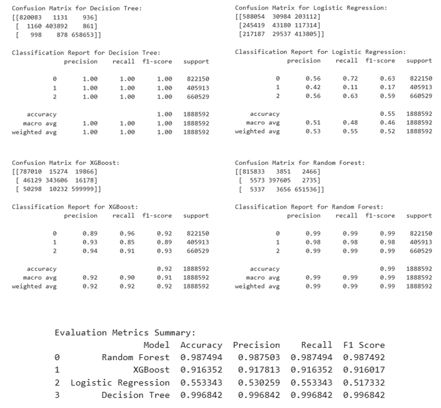
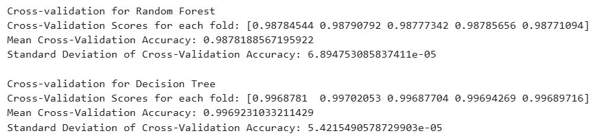
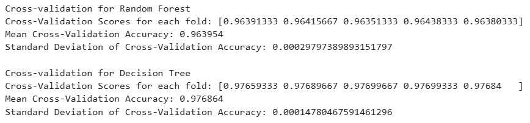
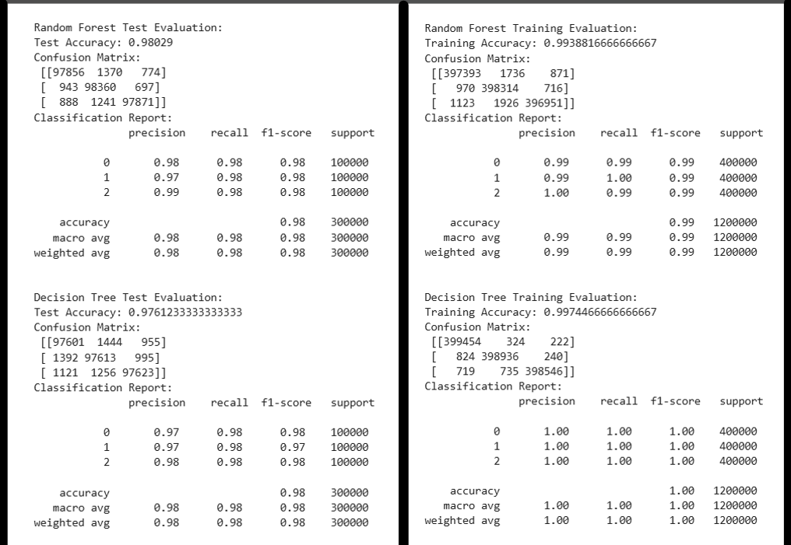
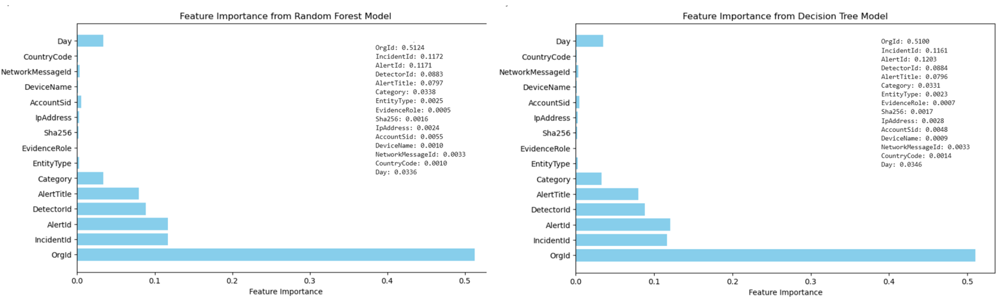
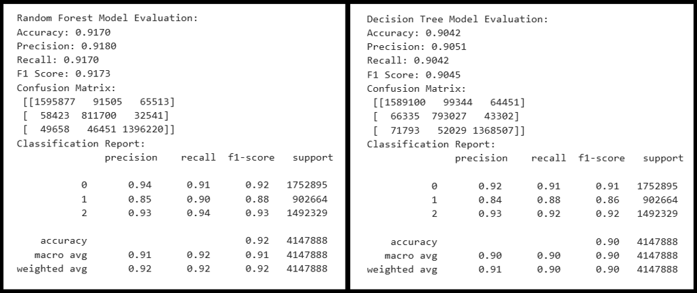

# Cybersecurity Incident Detection with Machine Learning
## Enhancing Security Operations with Predictive Analytics

### Overview
In today’s fast-evolving cybersecurity landscape, Security Operations Centers (SOCs) are inundated with an overwhelming number of alerts and incidents. This project seeks to address this challenge by leveraging machine learning models to predict and classify cybersecurity incidents, aiding SOC analysts in making more informed decisions and responding to threats faster and more effectively. By using Microsoft’s innovative GUIDE dataset, this work lays the foundation for creating intelligent, automated systems that can help secure enterprise environments from emerging threats.

### Problem Statement
The main objective of this project is to build a machine learning model capable of predicting the triage grade of cybersecurity incidents, helping SOC analysts focus on the most critical threats. The model, trained on the GUIDE dataset, classifies incidents as True Positive (TP), Benign Positive (BP), or False Positive (FP) based on past data and customer feedback. This classification supports guided response systems, assisting analysts with actionable insights for incident management and mitigation.

### Key Use Cases
This project offers valuable solutions across various business functions in the realm of cybersecurity:

- **Automating Incident Triage in SOCs**: By classifying and prioritizing cybersecurity incidents, SOC analysts can streamline response efforts and handle high-priority threats more efficiently.
- **Guided Incident Response**: The model enables automated systems to suggest actions for different types of incidents, accelerating threat resolution.
- **Enhanced Threat Intelligence**: Incorporating historical data, alerts, and customer responses into threat detection results in more accurate identification of malicious activities.
- **Optimizing Enterprise Security**: By reducing false positives, enterprises can ensure that genuine threats are promptly mitigated, improving overall system security.

### Dataset
The dataset used for this project, **GUIDE**, is one of the largest of its kind, providing rich, structured data on cybersecurity incidents:

- **Size & Structure**: It contains over 13 million pieces of evidence, spread across 1 million+ annotated incidents.
- **Incident Types**: Evidence is organized into three hierarchical levels: Evidence (raw data), Alert (aggregated data points), and Incident (comprehensive records of alerts).
- **Security Context**: The dataset features telemetry data from over 6,100 organizations and covers 441 MITRE ATT&CK techniques.
- **Training & Testing Split**: The dataset is divided into a training set (70%) and a test set (30%), ensuring robust evaluation of model performance.

### Data Privacy and Anonymization
Given the sensitivity of cybersecurity data, the GUIDE dataset has undergone rigorous privacy protection processes, including:

- **Pseudo-anonymization**: Hashing sensitive identifiers with SHA1 to preserve privacy while maintaining data integrity.
- **Random ID Replacement**: Substituting original IDs with random IDs to protect anonymity.
- **Temporal Noise**: Modifying timestamps to prevent re-identification of individuals or organizations.

### Metrics for Success
To evaluate the effectiveness of the machine learning models, we use the following metrics:

- **Primary Metric**: Macro-F1 score for accurate triage grade prediction.
- **Secondary Metrics**: Precision and recall for assessing the accuracy of proposed remediation actions.

# Approach

This project focuses on preprocessing and exploratory data analysis (EDA) for both training and testing datasets, followed by model training, evaluation, and testing on a large-scale dataset. Below is the step-by-step breakdown:

---

## Step 1: Preprocessing and EDA for Train and Test Datasets

### 1. Preprocessing:
- Imported necessary libraries and modules.
- Read the train dataset and conducted an initial inspection.
- **Data Cleaning**:
  - Dropped duplicate rows.
  - Dropped rows with 50% or more null values.
  - Removed remaining null values.
- **Feature Engineering**:
  - Extracted `Day`, `Month`, and `Hour` from the `Timestamp` column.

### 2. Exploratory Data Analysis (EDA):
- Visualized distributions and patterns using:
  - Count plot for target column classes.
  - Bar plots for `IncidentGrade` counts by:
    - Category
    - EntityType
    - Evidence
    - Day of the month
    - Month
    - Hour of the day
- Generated a **correlation heatmap** for all numerical columns.
  - Dropped one of two highly correlated columns (≥ 80%) to reduce redundancy and multicollinearity.
- Applied **Label Encoding** for categorical columns.
  - Opted for label encoding instead of one-hot encoding due to the high number of categories.
- Saved the cleaned and processed train dataset.

### 3. Test Dataset:
- Repeated the above preprocessing and EDA steps for the test dataset.

---

## Step 2: Model Training and Testing

### 1. Data Preparation:
- Imported necessary libraries and loaded the preprocessed train dataset.
- Selected the top 15 features using ANOVA feature selection.

### 2. Model Training:
- Trained four models using stratified sampling on the full dataset with 9.8 million rows:
  - Logistic Regression
  - Decision Tree
  - Random Forest
  - XGBoost
- **Observations**:
  - **Random Forest** and **Decision Tree** showed superior performance.
  - Due to the dataset's size, stratified sampling was applied to create a balanced subset of 500,000 rows per class for efficient processing.

### 3. Cross-Validation and Hyperparameter Tuning:
- Applied **cross-validation** for robust evaluation.
- Used **RandomizedSearchCV** for hyperparameter tuning of Decision Tree and Random Forest models.

### 4. Feature Importance Analysis:
- Analyzed feature importance using model-specific measures (e.g., feature importance in Random Forest).

### 5. Error Analysis:
- Identified and analyzed misclassifications for Decision Tree and Random Forest models.

### 6. Final Evaluation:
- Evaluated models on the **test dataset** using key metrics:
  - Accuracy
  - Precision
  - Recall
  - F1-Score
  - Confusion Matrix

## Results / Findings

### Initial Model Evaluation on Full Dataset (9.8 Million Rows)

When I used the full dataset of **9.8 million rows** for training all 4 models, I observed the following performance:

- **Decision Tree**: Achieved the highest accuracy of **99.68%** and an F1-score of **99.68%**, with minimal misclassifications.
- **Random Forest**: Performed exceptionally well with an accuracy of **98.75%** and F1-score of **98.75%**, making it robust and reliable.
- **XGBoost**: Achieved an accuracy of **91.64%** and F1-score of **91.60%**, performing moderately but less effective compared to tree-based models.
- **Logistic Regression**: Struggled with an accuracy of **55.33%** and an F1-score of **51.73%**, indicating limited applicability for this dataset.

### Cross-Validation Results

Based on cross-validation, **Decision Tree** and **Random Forest** consistently performed well:

- **Decision Tree**: Achieved a mean accuracy of **99.69%** with a very low standard deviation of **0.000054**, indicating high reliability and stability across folds.
- **Random Forest**: Achieved a mean accuracy of **98.78%** with a low standard deviation of **0.000069**, showcasing robust performance but slightly lower than Decision Tree.

Both models demonstrated strong performance, with **Decision Tree** marginally better in terms of consistency and accuracy.

### Sampling Due to Large Dataset Size

Given the large dataset size and prolonged execution times, I sampled **500,000 rows per class** (balanced dataset) from the full dataset for both training and testing.

After applying **Cross-validation** for the **Decision Tree** and **Random Forest** models on this sample dataset, I observed:

- **Random Forest**: Achieved a mean cross-validation accuracy of **96.40%** with a standard deviation of **0.03%**, indicating consistent performance across folds.
- **Decision Tree**: Achieved a higher mean cross-validation accuracy of **97.68%** with a standard deviation of **0.01%**, demonstrating both better performance and stability compared to Random Forest.

### Hyperparameter Tuning Results (Randomized Search CV)

**Hyperparameter Tuning** was performed using **Randomized Search CV** on both models. Below are the results:

- **Random Forest**:
  - **Training Accuracy**: **99.39%**
  - **Test Accuracy**: **98.03%**
  - **Performance**: Strong precision, recall, and F1-score (**0.98** for all classes)
  
- **Decision Tree**:
  - **Training Accuracy**: **99.74%**
  - **Test Accuracy**: **97.61%**
  - **Performance**: Excellent precision, recall, and F1-score (**0.97 to 0.98** for all classes)

Both models showed strong results, with **Random Forest** outperforming **Decision Tree** slightly on the test set.

### Important Features

### Errors / Misclassifications

- **Random Forest**: A total of **5,913 misclassifications** were observed, with the most common being **class 0 predicted as class 1** (1,370 times).
- **Decision Tree**: A total of **7,163 misclassifications** were observed, with the most common being **class 0 predicted as class 1** (1,444 times).

### Final Model Evaluation on Test Set (4.1 Million Rows)

After training the models on the **1.5 million row sample dataset** (500,000 rows per class), the evaluation on the **4.1 million test dataset** yielded the following results:

#### Random Forest:
- **Accuracy**: **91.70%**
- **Precision**: **91.80%**
- **Recall**: **91.70%**
- **F1 Score**: **91.73%**
- **Confusion Matrix**: Good performance across all classes
- **Classification Report**:
  - Class 0 (94% precision)
  - Class 1 (85% precision)
  - Class 2 (93% precision)

#### Decision Tree:
- **Accuracy**: **90.42%**
- **Precision**: **90.51%**
- **Recall**: **90.42%**
- **F1 Score**: **90.45%**
- **Confusion Matrix**: Slightly lower performance compared to Random Forest
- **Classification Report**:
  - Class 0 (92% precision)
  - Class 1 (84% precision)
  - Class 2 (93% precision)

### Notes

- Models were trained on a **1.5 million row sample dataset** (500,000 rows per class) and evaluated on a **4.1 million test dataset**.
- If the **9.8 million row training dataset** had been used for hyperparameter tuning and training, the evaluation scores on the **4.1 million test dataset** might have improved. However, due to the size of the dataset, it was impractical to process in a reasonable time, so a sample dataset was used instead.

## Recommendations for Integration into SOC Workflows

To ensure the model can be effectively integrated into Security Operations Center (SOC) workflows, the following recommendations are proposed:

1. **Automated Incident Triage:**
   - Integrate the model with existing Security Information and Event Management (SIEM) systems to automate the triage of incoming alerts.
   - Use the model's predictions (TP, BP, FP) to prioritize incidents, enabling SOC analysts to focus on critical threats first.

2. **Continuous Model Training:**
   - Given the dynamic nature of cybersecurity, periodically retrain the model using updated incident data to maintain prediction accuracy and relevance.
   - Implement a feedback loop where analysts' actions (e.g., false positive/true positive classifications) are fed back into the model for continuous improvement.

3. **Real-Time Threat Detection:**
   - Deploy the model in real-time monitoring systems to provide immediate classification and action recommendations as new incidents occur.
   - Ensure the system is capable of handling high volumes of alerts, especially in large enterprise environments, by optimizing the model's processing speed.

4. **Integration with Incident Response Tools:**
   - Extend the model's capabilities to suggest remediation actions for different incident types, assisting SOC analysts with automated responses or playbooks.
   - Build an intuitive user interface that visualizes incident triage results and recommended actions to streamline analyst workflows.

5. **Model Interpretability:**
   - Implement tools for explaining model predictions (e.g., feature importance visualizations) to enhance analyst trust in the model’s decisions.
   - Provide decision-support insights for both automated and manual incident responses.

## Conclusion
This project demonstrates the potential of machine learning in automating and enhancing cybersecurity incident detection within Security Operations Centers (SOCs). By leveraging the GUIDE dataset, the machine learning models developed—specifically Decision Tree and Random Forest—can significantly reduce the time and effort needed for incident triage and prioritization, allowing SOC analysts to focus on the most critical threats.

The integration of these models into existing SOC workflows can lead to a more efficient and effective response to security incidents, helping enterprises stay one step ahead of emerging threats. With continuous model training and feedback loops, this system can evolve alongside the ever-changing cybersecurity landscape, providing valuable insights and improving the overall security posture of organizations.

## Future Work
While the current models show promising results, there are several areas for future improvement:

- **Model Optimization**: Exploring more advanced techniques such as neural networks and ensemble methods could further improve model accuracy and efficiency.
- **Real-Time Adaptation**: Implementing a real-time adaptation mechanism that allows the model to learn from new data as it becomes available could further increase its effectiveness.
- **Scalability**: Enhancing the model’s scalability to handle even larger datasets and faster processing times could be crucial for enterprise-level applications.

## Acknowledgements
We would like to express our gratitude to the contributors of the GUIDE dataset for providing valuable resources, and to the cybersecurity community whose work continues to advance the field.

## References
- GUIDE dataset: [[Link to dataset](https://drive.google.com/drive/folders/18vt2lkf69MggXitrTSn9qnZ8s-ToeKcH)]
- Scikit-learn documentation: [[Link to documentation](https://scikit-learn.org/0.21/documentation.html)]
- XGBoost documentation: [[Link to documentation](https://xgboost.readthedocs.io/en/latest/)]
